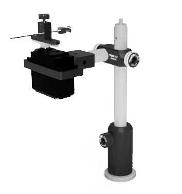
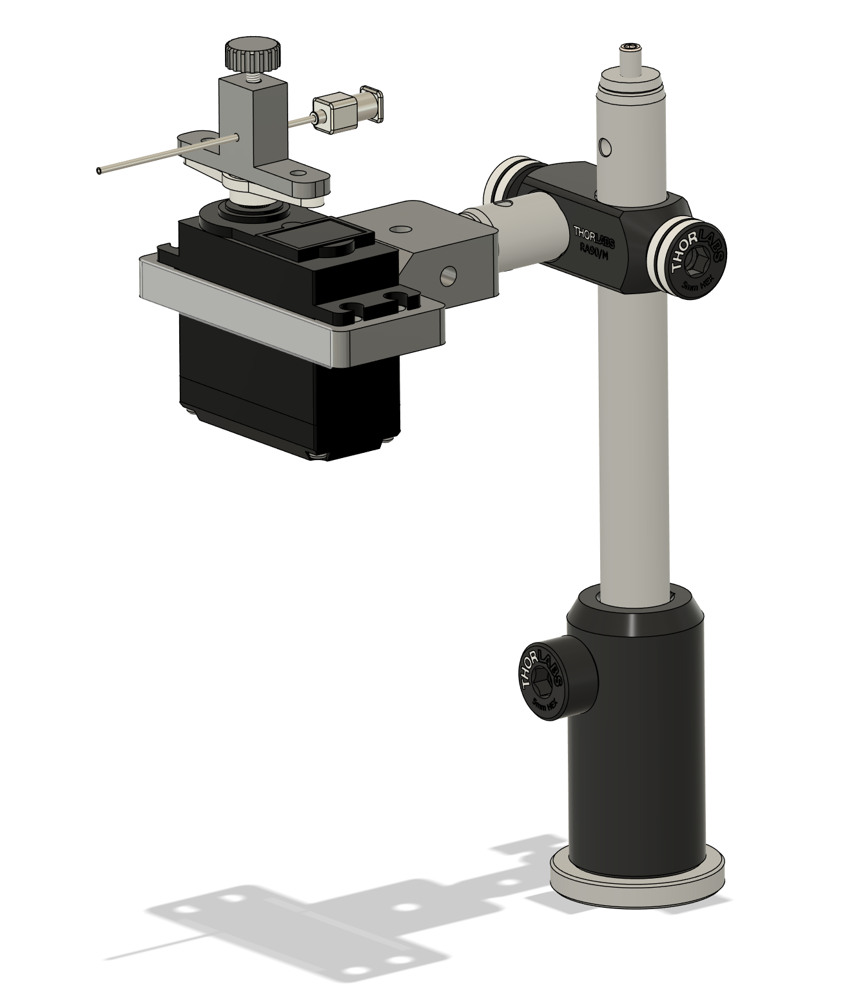
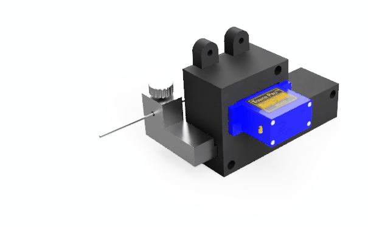
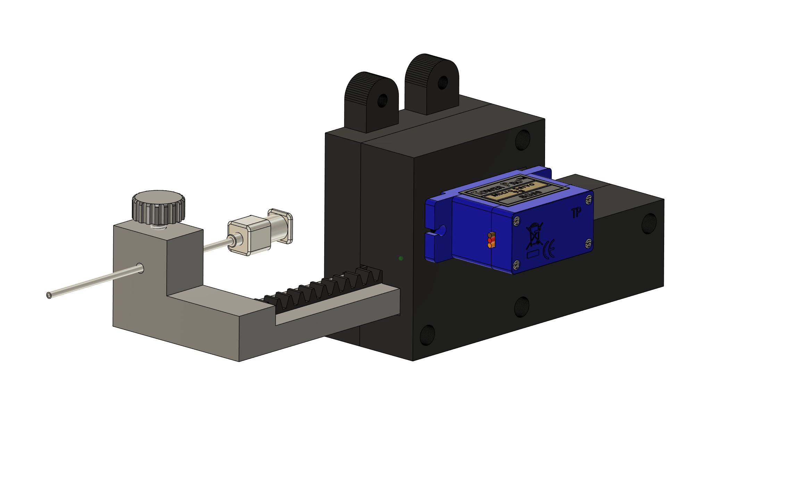

# LickOmeter

This is a guide to build your own motorized LickOmeter based on the arduino capacitive sensor library. Measuring the capacity allows detection of individual licks and therefore direct reward acceptance in the context of many different behavioral research experiments. The repository provides all necessary information to reproduce this device and coding exercises for the general understanding of the resulting data.

Only basic Arduino skills like connecting and uploading code are required for this tutorial.

---

## System Integration

The device modular integration in existing experimental instruments using 5V Digital/Analog TTL signaling via coaxial BNC cables (e.g. with NI-DAQ, cDAQ or dSpace Microlabox) or using Serial Communication via a USB cable (e.g. Python, MATLAB, Bonsai). For the future, integration in the bPod system is planned.

The current firmware allows to control the position of the lickspout with a 5V Digital via a coaxial BNC cable (0V):

0V (LOW) -> Lickspout OUT  
5V (HIGH) -> Lickspout IN

Coupling the Lick-OUT signal with a syringe pump, peristaltic pump or solenoid valve allows controlled application of reward. Also, the LickOmetor can run independently if powered with a 12V power supply and does not necessarily need to be connected to a computer.

Modification of this firmware would also allow to control the lickspout with Serial Communication via USB.

---

## Lickspout Motorization

Currently, two actuators are implemented for custom use cases. The rotary actuator directly couples servo motor rotation to the lickspout, while the linear actuator transforms servo motor rotation via a gear-rack system to linear motion.

### Rotary Actuator

  
  

**Figure 1:** Rotary actuator can show or hide the lickspot to a specimen in a headfixed experimental setup with for example imaging of neuronal activity in behavioral research.

### Linear Actuator

  
  

**Figure 2:** Linear actuator adapted from [OHRBETS Repository](https://github.com/agordonfennell/OHRBETS) with modified Lickspout holder for [Hugo Basile Delta Maze](https://ugobasile.com/products/categories/mazes-tracking/delta-maze). Modified holder is available [here](/Manufacturing_Files/Linear_Action/).

---

## Electronics

Electronics can be further improved if necessary:

Research has shown that a small capacitor (100 pF) or so from sensor pin to ground improves stability and repeatability.
Adding small capacitor (20 - 400 pF) in parallel with the body capacitance, is highly desirable too, as it stabilizes the sensed readings.

### Capacitive Sensor Exercises

[Capacitive Sensor Exercises](./Capacitive_Sensor_Exercises) (Adding a threshold for touch induced triggering)

---

## Bill of Materials:

Oscilloscope and or Pulse Generator (BIT-boy) should be available for debugging.

### For Prototyping and Exercises:

|Item|Description|Amount|Link|
|---|---|---|---|
|Breadboard| ||[Link](https://www.conrad.de/de/p/tru-components-steckplatine-bus-stripe-ausklappbar-polzahl-gesamt-400-l-x-b-82-5-cm-x-54-6-mm-1-st-2885952.html?insert=VQ)|
|Project Holder|||[Link](https://whadda.com/product/project-holder-for-arduino-uno-development-board-with-breadboard-wpa508/)|
|Jumper Wires|||[Link](https://www.conrad.de/de/p/tru-components-jumper-kabel-arduino-1x-drahtbruecken-buchse-1x-drahtbruecken-buchse-bunt-2481791.html?insert=VQ)|
|Arduino Uno Rev3|||[Link](https://store.arduino.cc/products/arduino-uno-rev3)|
|BNC to Screw Clamp|||[Link](https://www.conrad.de/de/p/tru-components-lt-bnc-f-bnc-steckverbinder-buchse-gerade-50-1-st-1570975.html?insert=VQ)|
|Blunt Stainless Steel Syringe Neegle Gauge 18 (Sigma-Aldrich Z113042-1EA) |||[Link](https://www.sigmaaldrich.com/DE/de/product/aldrich/z113042)|
|Coaxial BNC Cable 50 Ohm Impedance|||[Link](https://www.conrad.de/de/p/tru-components-16-0330-bnc-messleitung-1-00-m-schwarz-2108306.html?insert=VQ)|
|Red LED 5mm Diameter|||[Link](https://www.conrad.de/de/p/tru-components-1573739-led-bedrahtet-rot-rund-5-mm-130-mcd-50-20-ma-2-1-v-1573739.html?insert=VQ)|
|Servo Motor MG995|||[Link](https://www.conrad.de/de/p/whadda-wpm603-entwicklungsboard-1-st-2481920.html?insert=VQ)|
|Male Pin Header|||[Link](https://www.conrad.de/de/p/tru-components-tc-9556692-stiftleiste-standard-anzahl-reihen-1-polzahl-je-reihe-40-1-st-2389173.html?insert=VQ)|
|Alligator Clip to Jumper Wire|||[Link](https://www.adafruit.com/product/4304)|
|Resistor Kit (1x 10 MOhm for Sensor (can be 100 kOhm to 50 MOhm) 1x 220 Ohm for LED)|||[Link](https://www.conrad.de/de/p/tru-components-418706-kohleschicht-widerstand-sortiment-axial-bedrahtet-5-390-teile-1564789.html?insert=VQ)|
|USB-A to USB-B Cable 0.5 m|||[Link](https://www.conrad.de/de/p/renkforce-usb-kabel-usb-2-0-usb-a-stecker-usb-b-stecker-0-50-m-schwarz-vergoldete-steckkontakte-rf-4463067-1487689.html?insert=BP)|

**Tip:** Many of those parts are also available in the [Arduino Starter Kit](https://store.arduino.cc/products/arduino-starter-kit-multi-language).

### For Enclosure with Power Supply:

The listed parts are required additionally to the above listed items.

|Item|description|amount|link|
|---|---|---|---|
|Electronics Box|||[Link](https://www.conrad.de/de/p/donau-elektronik-kgb15-523132-universal-gehaeuse-135-x-95-x-45-polystyrol-eps-grau-1-st-523132.html?insert=VQ)|
|12V Power Supply|||[Link](https://www.conrad.de/de/p/voltcraft-sng-12-1500-ow-n-steckernetzteil-festspannung-12-v-dc-1-5-a-18-w-offene-kabelenden-2264179.html?insert=VQ)|
|Heat-Shrink Tubing Assortment|||[Link](https://www.conrad.de/de/p/delock-20735-schrumpfschlauchsortiment-schwarz-1-st-3382844.html?insert=BP)|
|Flexible Jumper Wires|||[Link](https://www.conrad.de/de/p/renkforce-jkmf403-jumper-kabel-arduino-banana-pi-raspberry-pi-40x-drahtbruecken-stecker-40x-drahtbruecken-buchse-30-2299844.html?insert=BP)|
|LED Holder|||[Link](https://www.conrad.de/de/p/tru-components-tc-pcl-5a203-polyamid-6-6-passend-fuer-leds-led-5-mm-snapin-1593487.html?insert=BP)|
|BNC Connector for Panel Mounting|||[Link](https://www.conrad.de/de/p/tru-components-tc-9962736-bnc-steckverbinder-buchse-einbau-vertikal-50-1-st-2490684.html?insert=BP)|
|Fuse Holder for Panel Mounting|||[Link](https://www.conrad.de/de/p/tru-components-tc-r3-12-sicherungshalter-passend-fuer-sicherungen-feinsicherung-5-x-20-mm-10-a-250-v-ac-1-st-1587496.html?insert=BP)|
|Fuse 2 A|||[Link](https://www.conrad.de/de/p/eska-522-720-522720-feinsicherung-o-x-l-5-mm-x-20-mm-2-a-250-v-traege-t-inhalt-10-st-523987.html?insert=BP)|
|On/Off Switch for Panel Mounting|||[Link](https://www.conrad.de/de/p/tru-components-700185-wippschalter-r13-112a-b-b-0-i-250-v-ac-6-a-1-x-aus-ein-rastend-1-st-1565955.html?insert=BP)|
|Barrel Plug 12V 2.1 mm for Panel Mount |||[Link](https://www.conrad.de/de/p/tru-components-niedervolt-steckverbinder-buchse-einbau-vertikal-5-8-mm-2-1-mm-1-st-1567097.html?insert=BP)|
|Barrel Plug 12V 2.1 mm for Internal Connection|||[Link](https://www.conrad.de/de/p/tru-components-dc14-m-niedervolt-steckverbinder-stecker-gerade-5-5-mm-2-1-mm-1-st-1570700.html?insert=BP)|
|USB-B to USB-A Connector for Panel Mounting|||[Link](https://www.conrad.de/de/p/reversible-usb-durchfuehrung-2-0-buchse-einbau-neu-durchfuehrung-nausb-w-neutrik-inhalt-1-st-746647.html?insert=BP)|
|USB-B Cable for Internal Connection|||[Link](https://www.conrad.de/de/p/lindy-usb-kabel-usb-2-0-usb-a-stecker-usb-b-stecker-0-20-m-schwarz-grau-36670-2534819.html?insert=BP)|
|Red and Black Wire for Power Cabling 0.75 mm2 |||[Link](https://www.conrad.de/de/p/donau-elektronik-275-01-25-litze-liy-z-2-x-0-75-mm-rot-schwarz-1-st-3594132.html?insert=BP)|

**Note:** Access to a soldering station, lighter, hand drill and basic tools is required for assembly.

### For Rotary Actuator:

|Item|description|amount|link|
|---|---|---|---|
|Servo MG995|||[Link](https://www.conrad.de/de/p/whadda-wpm603-entwicklungsboard-1-st-2481920.html?insert=VQ)|
|Custom Servo Holder|||[Link](/Manufacturing_Files/Rotary_Action/Lickspout_Holder.stl)|
|Custom Lickspout Holder|||[Link](/Manufacturing_Files/Rotary_Action/Servo_Holder.stl)|
|Custom Knurled Head Screw|||[Link](/Manufacturing_Files/Rotary_Action/M3_Knurled_Head_Screw.stl)|
|Pedestal Post Holder 54.7 mm|||[Link](https://www.thorlabs.com/item/PH50E_M)|
|Right-Angle Clamp for 1/2" Posts|||[Link](https://www.thorlabs.com/item/RA90_M)|
|Optical Post 40 mm Length|||[Link](https://www.thorlabs.com/item/TR40_M)|
|Optical Post 150 mm Length|||[Link](https://www.thorlabs.com/item/TR150_M)|

### For Linear Actuator:

|Item|description|amount|link|
|---|---|---|---|
|Servo 180 degrees|||[Link](https://whadda.com/product/mini-analog-servo-9-g-wpm600/)|
|Custom Lickspout Holder|||[Link](/Manufacturing_Files/Linear_Action/Lickspout_Holder.step)|
|Custom Knurled Head Screw|||[Link](/Manufacturing_Files/Rotary_Action/M3_Knurled_Head_Screw.stl)|
|Linear Actuator|||[Link](https://github.com/agordonfennell/OHRBETS)|

### For Reward Delivery with Syringe Pump:

|Item|description|amount|link|
|---|---|---|---|
|WPI Syringe Pump AL-1000|||[Link](https://www.wpi-europe.com/products/pumps--microinjection/laboratory-syringe-pumps/al-1000.aspx)|
|Syringe all glass fortuna optima luer-lock-tip (Sigma-Aldrich, Z31456-1EA, Lot 20228270)|||[Link](https://www.sigmaaldrich.com/DE/de/search/z314536-1ea?focus=products&page=1&perpage=30&sort=relevance&term=z314536-1ea&type=product)|
|Serial d-Sub RS-232 extension cable for custom BNC connector and triggering|||[Link](https://www.conrad.de/de/p/renkforce-seriell-verlaengerungskabel-1x-d-sub-stecker-9pol-1x-d-sub-buchse-9pol-2-00-m-beige-1371918.html?insert=BP&searchType=SearchRedirect)|
|BNC to Screw Clamp|||[Link](https://www.conrad.de/de/p/tru-components-lt-bnc-f-bnc-steckverbinder-buchse-gerade-50-1-st-1570975.html?insert=VQ)|
|Luer-to-Tubing Coupler Assortment Kit|||[Link](https://wpiinc.com/products/504954-luer-to-tubing-coupler-assortment-kit-polypropylene?_pos=2&_sid=afe142875&_ss=r)|
|PVC Tubing with Luer Ends Masterflex|||[Link](https://www.fishersci.de/shop/products/fitting-ends-pvc-tubing/11702663#?keyword=tube%20luer)|

#### Custom Made Serial RS-232 to BNC Cable Pin Assignment for Syringe Pump:

|Pin|Definition|Function|Cable|
|---|---|---|---|
|1|VCC (5V)|Logic High Reference, Power Indicator|Red|
|2|Operational Trigger In|Start/Stop Trigger (Configurable, See Manual)|Yellow|
|3|Pumping Direction In|Changes Pumping Direction (Conf., See Manual)|Blue|
|4|Event Trigger In|Event/User Definable Input|White|
|5|Program Out|Program Controlled/User Definable Output|Black|
|6|Program In| Program Conditional/User definable Input|Orange|
|7|Pump Motor Operating Out|High: Pumping; Low Not Pumping (Conf., See Manual)|Purple|
|8|Pumping Direction Out|High: Infuse; Low: Withdraw|Brown|
|9|Ground (0V) Reference|Logic Low Reference|Green|
|Shield|Ground|Cable Ground GND|Copper|

**Note:** The cable coloring is specific to the purchased serial cable and can vary between manufacturers. In some cases a color-pin assignment is provided with the packaging. If not the color-pin assignment can be tested with a multimeter by testing the continuity between each pin and individual cable colors.

**Remote Triggering the Pump:**

- **BNC connector 1:** yellow to Signal (+) and green to GND (-) - for triggering reward application.
- **BNC connector 2:** white to signal (+) and green to GND (-) - for recording pump events with DAQ and subsequent analysis.

**Programming the pump:**

- Press "Diamater/Setup" key and enter the inner syringe diameter im mm for calibration
- Press "Diameter/Setup" key until the first parameter is displayed. Chance the displayed parameter with an any non-arrow key and find "Ln: n". Now press an arrow key under the parameter to set it to"Ln: 1" for low noise mode.
- Press "Diameter/Setup" key until the first parameter is displayed. Chance the displayed parameter with an any non-arrow key and find "ttl". Press an arrow key to show "tr:aa". Press again an arrow key and set the parameter to "tr:T2" (Start Only Reversed). Now, a rising edge from a trigger input signal will start the pumping program.
- Press "Volume" and to change units to μl and enter the desired volume with the arrow keys.

-> The pump will now release the specified amount of μl per trigger pulse.

**Note:** This procedure is specific to this syringe pump model only. If another model is used, check the manual for instructions.

---

## Possible Future Updates

Following ideas are planned to be implemented in the future:

- Compatibility with [Sanworks bPod](https://sanworks.io) system
- Servo control via Serial Communication
- Custom PCB Design

## Links and Resources

- The linear actuator was modified from the [OHRBETS](https://github.com/agordonfennell/OHRBETS) repository.

- The designed was inspired by this a [blog post](https://scanbox.org/2016/04/14/a-simple-lick-o-meter-and-liquid-reward-delivery-system/) of Dario Ringach, PhD at UCLA ([Ringach Lab](http://ringachlab.net)).

- There is official documentation of the [Arduino Capacitive Sensor Library](https://playground.arduino.cc/Main/CapacitiveSensor/) and a [GitHub Repository](https://github.com/PaulStoffregen/CapacitiveSensor) of the maintainer Paul Stoffregen.

- There is official documentation of the [Arduino Servo Library](https://www.arduino.cc/reference/en/libraries/servo/) and an [Arduino Libraries GitHub Repository](https://github.com/arduino-libraries/Servo).

- There is official documentation of the [attachInterrupt() function](https://docs.arduino.cc/language-reference/en/functions/external-interrupts/attachInterrupt/).

---

## References

Development of this project was part of and funded by the [iBehave Network](https://ibehave.nrw). Following laboratories are currently working with the LichOmeter:

- Laboratory of Dr. Sabine Krabbe ([DZNE](https://www.dzne.de/forschung/forschungsbereiche/grundlagenforschung/forschungsgruppen/krabbe/forschungsschwerpunkte/) in Bonn, Germany): Dr. Benjamin Escribano developed the rotary actuator version for a head-fixed intra-vital 2P-Microscopy behavioral experiment.

- Laboratory of Prof. Jan Gründemann ([DZNE](https://www.dzne.de/forschung/forschungsbereiche/grundlagenforschung/forschungsgruppen/gruendemann/forschungsschwerpunkte) in Bonn, Germany): Eva Sebastian developed the linear actuator version for the [Hugo Basile Delta Maze](https://ugobasile.com/products/categories/mazes-tracking/delta-maze).

- Laboratory of Prof. Heinz Beck ([IEECR](https://ieecr-bonn.de), in Bonn, Germany): Bela Erlinghagen further developed the [Multiport Arena](https://github.com/BelaErlinghagen/MultiportArena) with the [Multiport Lickport](https://github.com/BelaErlinghagen/Multiport_Lickport). Josephine Timm further developed a version with randomized food application after a defined running period in the head-fixed [Treadwall](https://github.com/0815Phine/Treadwall) system with intra-vital 2P-Microscopy.

## Contact

This GitHub Repository is created ad maintained by Dr. Benjamin Escribano @ The CADRE - Collaborative Accelerator for Development and Research Engineering ([contact](https://ibehave.nrw/ibots-platform/CADRE/)).